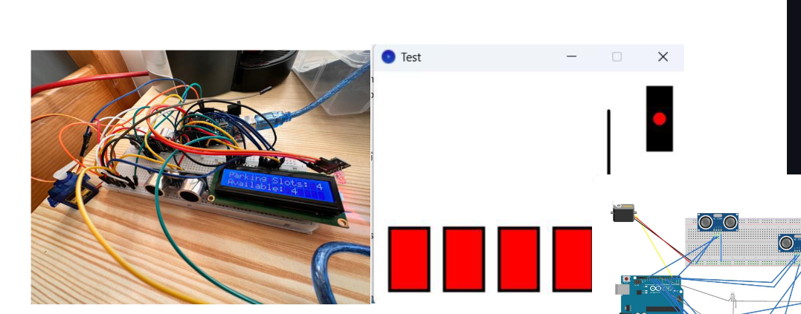
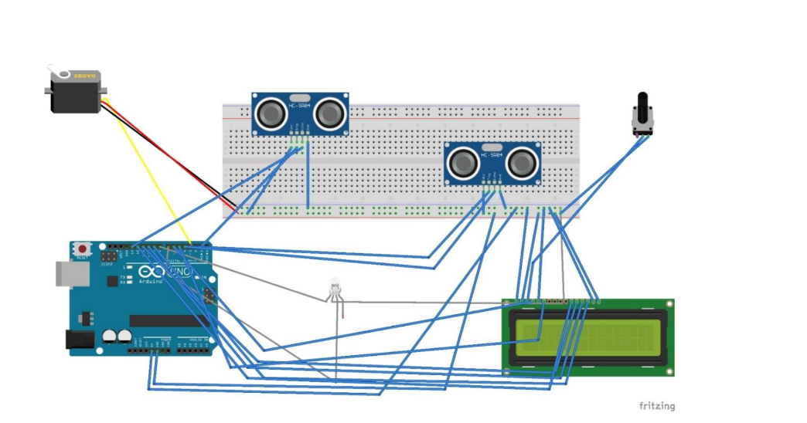

# Smart Parking System

## Overview
The Smart Parking System is an innovative project utilizing Arduino and sensors to manage a parking lot barrier. This system automates the opening and closing of a barrier, allowing or restricting vehicle access based on space availability. It integrates hardware and software solutions to improve parking management and reduce environmental impact by minimizing the time drivers spend searching for parking.

## System Images

### Parking Barrier Entry

*This image shows the ultrasonic sensor setup at the parking entry.*

### Parking Barrier Mechanism

*Image of the barrier mechanism controlled by the servo motor.*

## Features
- **Ultrasonic Sensors (HC-SR04)**: Detects the presence of a vehicle and measures the distance to the nearest object, determining barrier control.
- **Servo Motor**: Manages the movement of the barrier arm, allowing for precise control over the barrier's position.
- **LED Indicators**: Provides visual feedback on parking space availability, using red and green LEDs.
- **LCD Display**: Shows real-time information about the total number of parking spaces and how many are available.
- **Arduino Control**: Utilizes Arduino to manage inputs from sensors and control the barrier arm, LEDs, and LCD display.
- **Graphical Interface in Processing**: Displays the parking status visually on a computer, indicating occupied spaces and barrier status.

## Hardware Components
- **Arduino UNO**: The central controller used for interfacing with sensors, the servo motor, and other peripherals.
- **HC-SR04 Ultrasonic Sensors**: Two sensors used to detect vehicles and measure distances.
- **Servo Motor**: Controls the barrier's arm.
- **RGB LED Module**: Indicates the barrier status and parking availability.
- **LCD Display**: Provides a real-time count of available parking spaces.

## Software
- **Arduino Sketch**: Manages sensor data reading, servo control, LED logic, and LCD updates.
- **Processing Application**: Offers a graphical representation of the parking lot, showing occupied spaces and the status of the barrier in real-time.

## Installation
To set up your Smart Parking System, follow these steps:

### Prerequisites
- Arduino IDE
- Processing IDE

### Setup
1. **Connect the Hardware**:
   - Connect ultrasonic sensors, servo motor, LEDs, and LCD to the Arduino according to the provided wiring diagrams.
   - Ensure all components are securely connected and powered.

2. **Load the Arduino Sketch**:
   - Open the Arduino IDE and upload the provided sketch to the Arduino UNO.

3. **Run the Processing Application**:
   - Open the Processing IDE and load the graphical interface sketch.
   - Run the application to start monitoring the parking lot.

